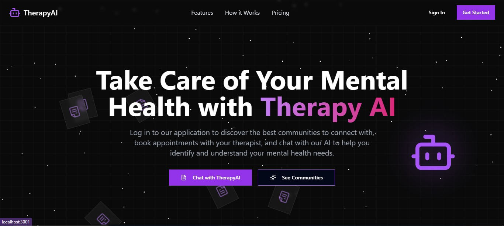
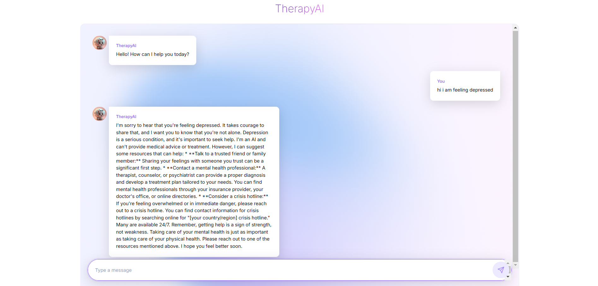
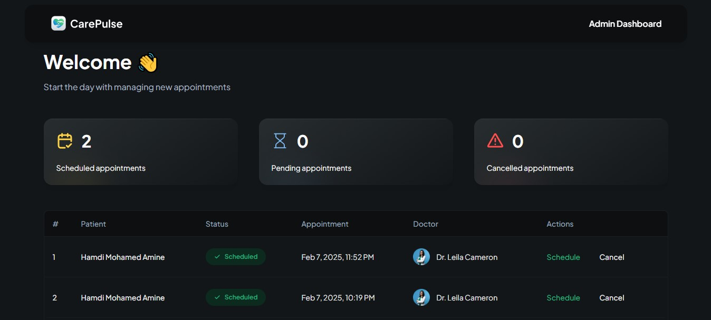
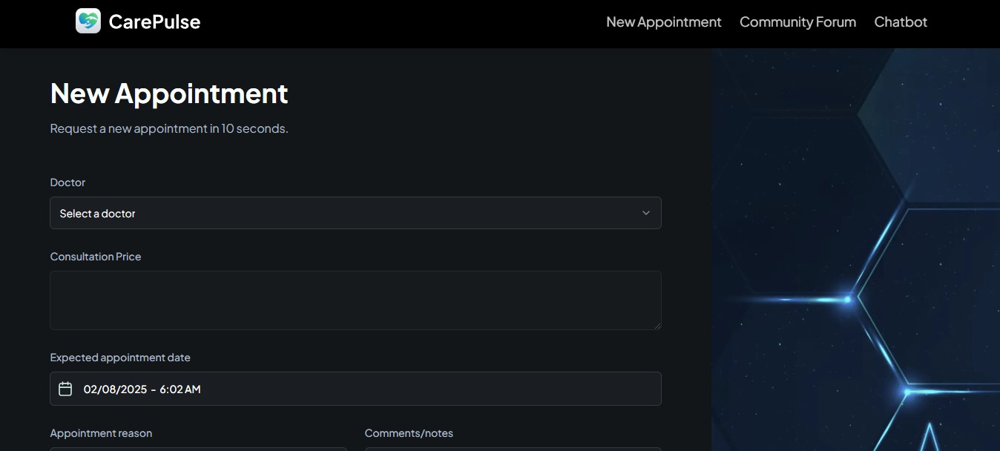
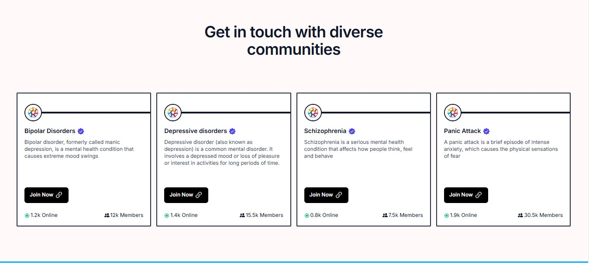
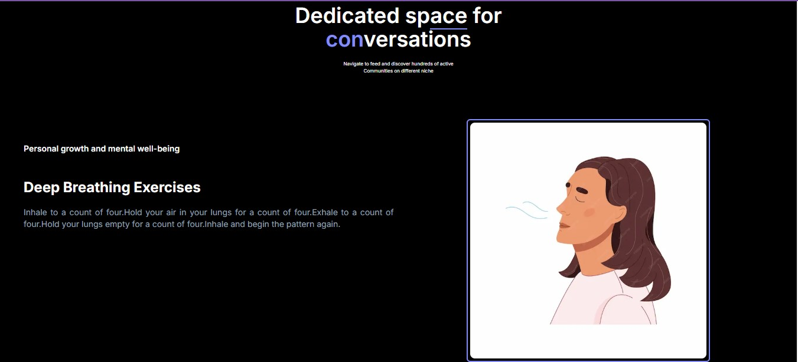
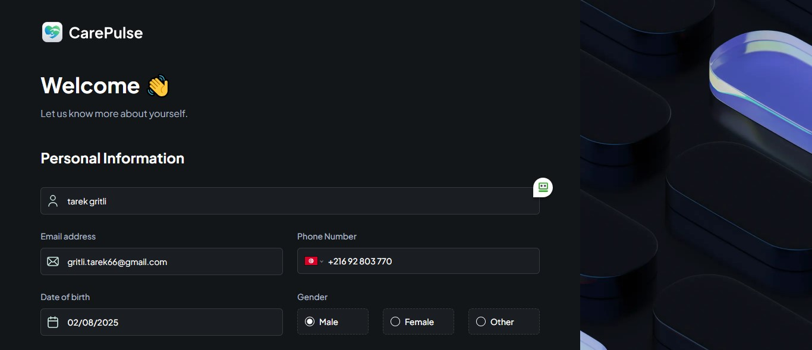
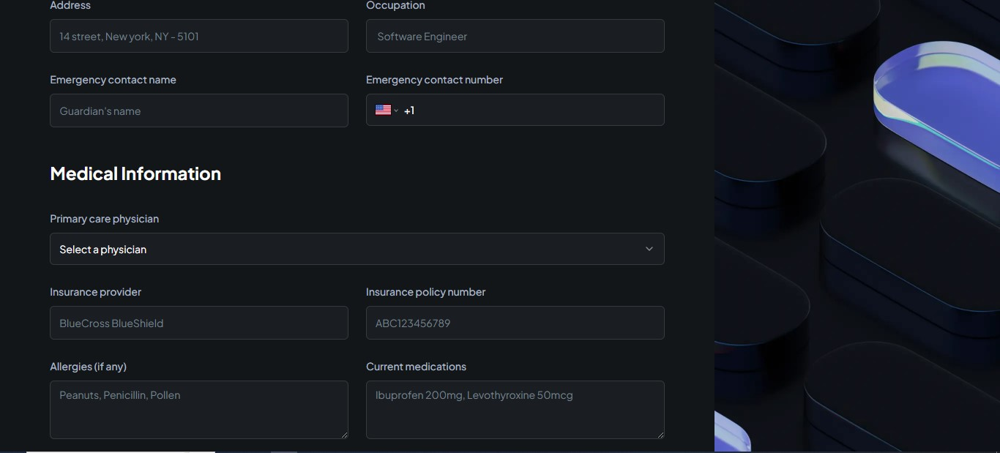

# 🧠 TherapyAI - AI-Powered Mental Health Support

<div align="center">
  <br />
  <!-- Add logo here -->
  
  <br />
  <br />
  
  <br />

  <div>
    
    
    
    
    
    
  </div>
  
  <h3 align="center">A Mental HealthCare Management System</h3>
</div>

## 📋 <a name="table">Table of Contents</a>

1. 📹 [Demo Video](#DemoVideo)
2. 👨🏻‍🏫 [Presentation](#Presentation)
3. 🤖 [Overview](#Overview)
4. ⚙️ [Features](#Features)
5. 🔋 [Tech Stack](#TechStack)
6. 🤸 [Getting Started](#GettingStarted)
7. 🕸️ [Contributors](#Contributors)
## Demo Video
Check out the demo video to see how the project works:

[Demo Video on Loom](https://www.loom.com/share/0d88cc1ec7214e32ae9617b828fe9450?sid=8cd65074-1a1c-4fb6-9329-fcca30089268)<br>
[Demo Video on Google Drive](https://drive.google.com/file/d/17U0nz_wzMtdTKaEQse1KIAAht8QIzId6/view?usp=sharing)

## Presentation

Check out the presentation for more details:

[Presentation on Canva](https://drive.google.com/file/d/1V6Pgfo4FLTjtZCX6nikcNFQTQAdjwxak/view?usp=sharing)

## Overview

TherapyAI is an AI-powered mental health application that provides users with personalized therapy support through a combination of:

- **🤖 AI Chatbot Therapist** trained in CBT (Cognitive Behavioral Therapy) principles
- **🩺 Live Sessions** with Licensed Therapists for professional mental health support
- **🌍 Community Support Forum** where users can connect and share experiences
- **📝 CBT Exercises & Mood Tracking** to help users manage their emotions effectively

## Features

### 🤖 AI Chatbot Therapist

- Provides real-time mental health support using CBT-based conversational AI
- Identifies negative thought patterns and suggests personalized CBT exercises
- Helps users track their emotional progress over time
- **Crisis Mode**: Detects emergency situations and provides immediate assistance
- **RAG-based Knowledge Retrieval** to improve chatbot accuracy and personalization

### 🩺 Live Therapy Sessions

- Users can schedule 1-on-1 therapy sessions with professional therapists
- Secure video calls & chat-based consultations
- **HIPAA & GDPR-compliant** for data privacy and security

### 🌍 Community Support Forum

- A safe space for users to share experiences and support each other
- Moderated by licensed mental health professionals
- Anonymous posting options for privacy

### 📝 CBT Exercises

- Users can access a library of CBT exercises to manage their mental health

### 🚨 Crisis Detection & Emergency Assistance

- AI detects suicidal ideation/self-harm risks and provides immediate support
- Suggests emergency contacts & hotlines
- Option to notify a trusted contact (with user consent)

## Tech Stack

| Component      | Technology                                          |
| -------------- | --------------------------------------------------- |
| **AI Chatbot** | Gemini, LangChain, RAG-based System                 |
| **Backend**    | Flask / Node.js                                     |
| **Database**   | Appwrite                                            |
| **Frontend**   | React.js, Next.js, tailwind css                     |
| **Security**   | End-to-End Encryption, OAuth, helmet, serenity, jwt |

## Getting Started

### 1. Clone the Repository

```bash
git clone https://github.com/tarek-gritli/TherapyAI-front.git
cd TherapyAI
```

### 2. Install Dependencies

```bash
pip install -r requirements.txt
```

### 3. Obtain a Gemini API Key

To use the AI Chatbot, you need to obtain a Gemini API key. Follow these steps:

1. Go to the [Google AI Studio](https://ai.google.dev/).
2. Sign in with your Google account.
3. Click on **"Create API Key"**.
4. Copy the generated API key.

### 4. Set Up the API Key

Once you have the API key, you need to set it up in the application. Create a `.env` file in the root directory of the project and add the following line:

```bash
GEMINI_API_KEY=your_gemini_api_key_here
```

Replace `your_gemini_api_key_here` with the API key you copied from Google AI Studio.

### 5. Run the Chatbot Application

#### Backend for Gemini

```bash
python gemini.py  # Runs Flask backend
```

### 6. Now running the web app

```bash
cd ..
cd MentalHealthCareApp
```

### 7. Installation

Install the project dependencies using npm:

```bash
npm install
```

### 8. Setting Up Environment Variables

Create a new file named `.env.local` in the root of your project and add the following content:

```env
#APPWRITE
NEXT_PUBLIC_ENDPOINT=https://cloud.appwrite.io/v1
PROJECT_ID=
API_KEY=
DATABASE_ID=
PATIENT_COLLECTION_ID=
APPOINTMENT_COLLECTION_ID=
NEXT_PUBLIC_BUCKET_ID=

NEXT_PUBLIC_ADMIN_PASSKEY=111111
```

Replace the placeholder values with your actual Appwrite credentials. You can obtain these credentials by signing up on the [Appwrite website](https://appwrite.io/).

### 9. Running the Project

```bash
npm run dev
```

Open [http://localhost:3000](http://localhost:3000) in your browser to view the project.

### 10. Running the forum app

```bash
cd ..
cd MentalHealthCareForum
```

### 11. Installing dependencies

Install the project dependencies using npm:

```bash
npm install
```

### 12. Running the Project

```bash
npm run dev
```

## Contributors 🎉

Thanks to all the amazing contributors who have helped build TherapyAI!

<table>
  <tr>
    <td align="center">
      <a href="https://github.com/abderbj">
        
        <br />
        <sub><b>Abderrahmane B.J</b></sub>
      </a>
    </td>
  </tr>
</table>
<table>
  <tr>
    <td align="center">
      <a href="https://github.com/tarek-gritli">
        
        <br />
        <sub><b>Tarek Gritli</b></sub>
      </a>
    </td>
  </tr>
</table>
<table>
  <tr>
    <td align="center">
      <a href="https://github.com/skan45">
        
        <br />
        <sub><b>Skander Gritli</b></sub>
      </a>
    </td>
  </tr>
</table>
<table>
  <tr>
    <td align="center">
      <a href="https://github.com/mohamedaminehamdi
">
        
        <br />
        <sub><b>Mohamed Amine Hamdi</b></sub>
      </a>
    </td>
  </tr>
</table>

---

This README provides a comprehensive guide to setting up and running the TherapyAI application. Make sure to follow the steps carefully to ensure a smooth setup process. If you encounter any issues, feel free to reach out to the support team.

## 📸 Screenshots

Here are some screenshots of the TherapyAI application in action:

### Home Page



### AI Chatbot Therapist



### Admin Dashboard



### User Dashboard



### Community Support Forum



### CBT Exercises



These screenshots provide a glimpse into the various features and functionalities of the TherapyAI application.

### Sign In

#### Page 1



#### Page 2


